# ViteNotes

<div align="center">


**🚀 基于 VitePress 深度定制的 AI 学习笔记文档框架**

[](https://vitepress.dev/)
[](https://vuejs.org/)
[](LICENSE)
[](https://github.com/FuTseYi/ViteNotes/pulls)

[在线预览](https://notes.xieyi.org) | [快速开始](#-快速开始) | [功能特性](#-功能特性) | [部署指南](#-部署指南)

简体中文 | [English](README.md)

</div>

---

## 📖 项目简介

**ViteNotes** 是一个从零开始构建和深度优化的 VitePress 文档框架，专为展示 AI 学习笔记而设计。本项目不仅实现了完整的配置逻辑，还提供了健硕完美的 UI 渲染方案，并创建了 Vue 组件实现与 VuePress 相同的阅读进度圈等实用性功能。

### 🎯 适用场景

- 📚 **技术文档**：适合构建技术博客、学习笔记、课程文档
- 🎓 **教育培训**：适合在线教程、培训材料、知识库
- 📊 **数据科学**：特别适合展示包含数学公式、图表的 AI/ML 内容
- 🌐 **多语言站点**：支持国际化配置，轻松构建多语言文档

---

## ✨ 功能特性

### 🎨 核心功能

- ✅ **Mermaid 图表支持**：内置流程图、时序图、甘特图等多种图表类型
- ✅ **LaTeX 数学公式**：完整支持行内公式和块级公式，自动横向滚动
- ✅ **阅读进度圈**：仿 VuePress 的阅读进度指示器，支持一键返回顶部
- ✅ **图片查看器**：集成 viewerjs，支持图片放大、缩放、旋转、切换等功能
- ✅ **时间线组件**：优雅展示项目进度和更新历史
- ✅ **自动侧边栏**：基于文件结构自动生成侧边栏，支持手动排序
- ✅ **国际化支持**：完整的多语言配置方案（中英文）
- ✅ **SEO 优化**：自动生成 sitemap、robots.txt、Open Graph 标签
- ✅ **响应式设计**：完美适配桌面端、平板、移动端
- ✅ **暗黑模式**：内置深色主题，自动适配系统偏好

### 🎨 UI/UX 优化

- 🌈 **自定义主题色**：天蓝色 (#87CEFA) 品牌色调，支持深色模式
- 🎭 **丝滑动画**：页面切换、卡片悬停、按钮交互均有精心设计的过渡效果
- 📱 **移动端优化**：表格横向滚动、侧边栏标题自动换行
- 🎯 **自定义卡片**：首页特色卡片（关于本站、收获、对比等）
- 🔍 **本地搜索**：内置全文搜索功能
- 📊 **表格自适应**：自动调整表格宽度，移动端支持横向滚动

### 🛠️ 开发体验

- ⚡ **快速热更新**：基于 Vite，开发环境秒级响应
- 📦 **自动化构建**：一键构建生产环境，自动生成 SEO 文件
- 🔧 **灵活配置**：统一的站点配置管理，易于维护
- 🌐 **局域网访问**：开发服务器支持局域网访问，方便多设备测试
- 📝 **TypeScript 支持**：配置文件使用 TypeScript，类型安全

---

## 🚀 快速开始

### 环境要求

- **Node.js**：>= 18.0.0
- **包管理器**：推荐使用 pnpm（也支持 npm、yarn）

### 安装步骤

#### 1. Fork 本仓库

点击右上角的 **Fork** 按钮，将项目 Fork 到你的 GitHub 账户。

#### 2. 克隆到本地

```bash
# 使用 HTTPS
git clone https://github.com/YOUR_USERNAME/ViteNotes.git

# 或使用 SSH
git clone git@github.com:YOUR_USERNAME/ViteNotes.git

# 进入项目目录
cd ViteNotes
```

#### 3. 安装依赖

```bash
# 使用 pnpm（推荐）
pnpm install

# 或使用 npm
npm install

# 或使用 yarn
yarn install
```

#### 4. 启动开发服务器

```bash
# 使用 pnpm
pnpm dev

# 或使用 npm
npm run dev

# 或使用 yarn
yarn dev
```

启动成功后，访问 `http://localhost:5173` 即可预览。

#### 5. 构建生产版本

```bash
# 使用 pnpm
pnpm build

# 或使用 npm
npm run build

# 或使用 yarn
yarn build
```

构建完成后，静态文件将生成在 `docs/.vitepress/dist` 目录。

#### 6. 本地预览生产版本

```bash
# 使用 pnpm
pnpm preview

# 或使用 npm
npm run preview

# 或使用 yarn
yarn preview
```

---

## 📁 项目结构

```
ViteNotes/
├── docs/                          # 文档根目录
│   ├── .vitepress/                # VitePress 配置目录
│   │   ├── config.ts              # 核心配置文件（★重点）
│   │   ├── theme/                 # 主题定制
│   │   │   ├── index.ts           # 主题入口（图片查看器、阅读进度圈）
│   │   │   ├── custom.css         # 自定义样式（★重点）
│   │   │   └── components/        # 自定义组件
│   │   │       └── ReadingProgress.vue  # 阅读进度圈组件
│   │   └── cache/                 # 构建缓存（自动生成）
│   ├── en/                        # 英文内容目录
│   │   ├── index.md               # 英文首页
│   │   ├── guide/                 # 指南
│   │   └── 80-MachineLearning/    # 机器学习笔记
│   ├── public/                    # 静态资源
│   │   └── favicon/               # 网站图标
│   └── zh/                        # 中文内容目录（可选）
├── package.json                   # 项目依赖配置
├── pnpm-lock.yaml                 # 依赖锁定文件
├── .gitignore                     # Git 忽略配置
├── LICENSE                        # 开源协议
└── README.md                      # 项目说明文档
```

---

## ⚙️ 配置说明

### 核心配置文件：`docs/.vitepress/config.ts`

本项目的所有配置集中在 `config.ts` 文件中，采用模块化设计，易于理解和修改。

#### 1. 站点基础配置

```typescript
const SITE_CONFIG = {
  // 站点标题配置
  title: "你的站点标题",           // 浏览器标签页标题
  siteTitle: "导航栏标题",         // 左上角导航栏标题
  description: "站点描述",         // SEO 描述
  
  // SEO 配置
  url: 'https://yourdomain.com',  // 网站域名（用于生成 sitemap）
  keywords: 'AI,机器学习,深度学习', // SEO 关键词
  author: '你的名字',              // 作者信息
  
  // 资源配置
  logo: '/favicon/logo.png',      // 网站 Logo
  favicon: {
    href: '/favicon/favicon.png', // 网站图标
    type: 'image/png'             // 图标类型
  },
}
```

#### 2. 侧边栏自动生成

使用 `vitepress-sidebar` 插件自动生成侧边栏：

```typescript
const commonSidebarConfig = {
  useTitleFromFileHeading: true,        // 使用文件第一个标题作为侧边栏标题
  useFolderTitleFromIndexFile: true,    // 使用 index.md 的标题作为文件夹标题
  useFolderLinkFromIndexFile: true,     // 文件夹链接指向 index.md
  hyphenToSpace: true,                  // 将连字符转换为空格
  collapsed: true,                      // 默认折叠子菜单
  excludePattern: ['public', 'assets'], // 排除的目录
  manualSortFileNameByPriority: [       // 手动排序优先级
    'guide',
    'MachineLearning'
  ],
}
```

#### 3. 国际化配置

支持多语言站点，默认配置英文：

```typescript
locales: {
  root: {
    label: 'English',
    lang: 'en',
    title: SITE_CONFIG.title,
    description: SITE_CONFIG.description,
    themeConfig: {
      nav: [
        { text: 'Home🏠️', link: '/' },
      ],
      sidebar: createSidebar('docs/en'),
    }
  },
  // 中文配置（取消注释即可启用）
  // zh: { ... }
}
```

#### 4. Markdown 增强

```typescript
markdown: {
  math: true,              // 开启 LaTeX 数学公式
  lineNumbers: true,       // 显示代码行号
  languageAlias: {         // 语言别名
    'gitignore': 'ini',
    'env': 'properties'
  },
  config: (md) => {
    md.use(timeline);      // 注册时间线插件
  },
}
```

#### 5. SEO 优化

自动生成 sitemap、robots.txt 和 Open Graph 标签：

```typescript
// Sitemap 自动生成
sitemap: { hostname: SITE_CONFIG.url }

// 动态生成每个页面的 SEO meta 标签
transformHead: ({ pageData }) => {
  // 自动生成 canonical、og:url、og:title 等标签
}

// 构建完成后自动生成 robots.txt
buildEnd: async (siteConfig) => {
  // 自动写入 robots.txt
}
```

### 自定义样式：`docs/.vitepress/theme/custom.css`

#### 1. 主题色定制

```css
:root {
  /* 品牌主色调 - 天蓝色 */
  --vp-c-brand-1: #6CB8E8;
  --vp-c-brand-2: #87CEFA;
  --vp-c-brand-3: #A3D9F5;
}
```

修改这些变量即可更换整站主题色。

#### 2. 自定义卡片样式

项目包含多种自定义卡片样式：

- `.info-card`：信息卡片
- `.outcome-card`：收获卡片
- `.audience-card`：受众卡片
- `.compare-card`：对比卡片

#### 3. 动画效果

所有页面切换、卡片悬停、按钮交互均有精心设计的过渡效果：

```css
/* 页面切换动画 */
.vp-doc {
  animation: slideInUp 0.6s cubic-bezier(0.25, 0.46, 0.45, 0.94);
}

/* 按钮悬停效果 */
.VPButton:hover {
  transform: translateY(-2px);
  box-shadow: 0 4px 12px rgba(0, 0, 0, 0.15);
}
```

### 自定义组件

#### 阅读进度圈：`ReadingProgress.vue`

仿 VuePress 的阅读进度指示器，特性：

- 实时显示阅读进度百分比
- 停止滚动 1.5 秒后显示返回顶部箭头
- 点击一键返回顶部
- 支持深色模式
- 移动端自适应

---

## 📝 内容编写指南

### 1. 创建新页面

在 `docs/en/` 目录下创建 Markdown 文件：

```markdown
---
title: 页面标题(用于SEO)
description: 页面描述（用于 SEO）
lastUpdated: true  # 显示最后更新时间
---

# 页面标题

页面内容...
```

### 2. 使用数学公式

```markdown
行内公式：$E = mc^2$

块级公式：
$$
\frac{-b \pm \sqrt{b^2 - 4ac}}{2a}
$$
```

### 3. 使用 Mermaid 图表

````markdown

```mermaid
graph LR
    A[开始] --> B[处理]
    B --> C[结束]
```

````

### 4. 使用时间线

```markdown
::: timeline 2025-12-24
#### 第一版
完成从 docsify 框架到 vitepress 的转变
:::

::: timeline 2025-12-25
#### 第二版
添加更多功能
:::
```

### 5. 插入图片

```markdown

```

图片会自动支持点击放大功能。

### 6. 使用自定义卡片

```html
<div class="info-card">
  <div class="info-card-content">
    <div class="audience-title">卡片标题</div>
    <div class="info-card-desc">
      卡片内容描述
    </div>
  </div>
</div>
```

---

## 🌐 部署指南

部署方式请参考 [VitePress 官方部署指南](https://vitepress.dev/guide/deploy)。

---

## 🔧 常见问题

### 1. 安装依赖失败

**问题**：`pnpm install` 报错

**解决方案**：
```bash
# 清除缓存
pnpm store prune

# 删除 node_modules 和 lock 文件
rm -rf node_modules pnpm-lock.yaml

# 重新安装
pnpm install
```

### 2. Mermaid 图表不显示

**问题**：Mermaid 图表在生产环境不显示

**解决方案**：确保 `config.ts` 中配置了 SSR 选项：
```typescript
vite: {
  ssr: {
    noExternal: ['vitepress-plugin-mermaid', 'mermaid'],
  },
}
```

### 3. 数学公式显示异常

**问题**：LaTeX 公式渲染错误或不显示

**解决方案**：
1. 确保 `markdown.math: true` 已开启
2. 检查公式语法是否正确
3. 块级公式使用 `$$` 包裹，行内公式使用 `$` 包裹

### 4. 图片查看器无法使用

**问题**：点击图片没有查看器效果

**解决方案**：确保 `theme/index.ts` 中已正确配置 `imageViewer`：
```typescript
import imageViewer from 'vitepress-plugin-image-viewer'
import 'viewerjs/dist/viewer.min.css'

setup() {
  const route = useRoute()
  imageViewer(route, '.vp-doc', {
    toolbar: {
      zoomIn: 4,
      zoomOut: 4,
      oneToOne: 4,
      reset: 4,
      prev: 4,
      next: 4,
    },
  })
}
```

### 5. 侧边栏不显示

**问题**：侧边栏为空或显示不正确

**解决方案**：
1. 检查文件结构是否正确
2. 确保 Markdown 文件有一级标题 `# Title`
3. 检查 `excludePattern` 是否排除了目标目录

### 6. 开发服务器无法访问

**问题**：`pnpm dev` 后无法访问 `localhost:5173`

**解决方案**：
1. 检查端口是否被占用
2. 尝试指定其他端口：
   ```typescript
   vite: {
     server: {
       port: 3000,
     }
   }
   ```

---

## 🤝 贡献指南

欢迎所有形式的贡献！无论是报告 Bug、提出新功能建议，还是提交代码改进。

### 贡献流程

1. **Fork 本仓库**
2. **创建特性分支**：`git checkout -b feature/AmazingFeature`
3. **提交更改**：`git commit -m 'Add some AmazingFeature'`
4. **推送到分支**：`git push origin feature/AmazingFeature`
5. **提交 Pull Request**

### 代码规范

- 使用 TypeScript 编写配置文件
- 遵循 Vue 3 Composition API 规范
- CSS 使用 BEM 命名规范
- 提交信息遵循 [Conventional Commits](https://www.conventionalcommits.org/)

---

## 📄 开源协议

本项目采用 [MIT License](LICENSE) 开源协议。

---

## 🙏 致谢

本项目基于以下优秀的开源项目构建：

- [VitePress](https://vitepress.dev/) - 基于 Vite 和 Vue 的静态站点生成器
- [Vue.js](https://vuejs.org/) - 渐进式 JavaScript 框架
- [Mermaid](https://mermaid.js.org/) - 基于文本的图表生成工具
- [MathJax](https://www.mathjax.org/) - 数学公式渲染引擎
- [viewerjs](https://github.com/fengyuanchen/viewerjs) - 强大的图片查看器
- [vitepress-plugin-image-viewer](https://github.com/T-miracle/vitepress-plugin-image-viewer) - VitePress 图片查看器插件
- [vitepress-sidebar](https://github.com/jooy2/vitepress-sidebar) - 自动侧边栏生成
- [vitepress-plugin-mermaid](https://github.com/emersonbottero/vitepress-plugin-mermaid) - Mermaid 集成插件
- [vitepress-markdown-timeline](https://github.com/HanochMa/vitepress-markdown-timeline) - 时间线组件

特别感谢 [Datawhale](https://www.datawhale.cn/) 开源学习平台提供的学习资源。

---

## 📧 联系方式

- **作者**：謝懿Shine
- **邮箱**：tseyi.wk@icloud.com
- **GitHub**：[@FuTseYi](https://github.com/FuTseYi)
- **个人博客**：[https://xieyi.org](https://xieyi.org)

---

## ⭐ Star History

如果这个项目对你有帮助，欢迎点个 Star ⭐️ 支持一下！


---

<div align="center">

**[⬆ 回到顶部](#vitenotes)**

Made with ❤️ by [謝懿Shine](https://github.com/FuTseYi)

</div>

